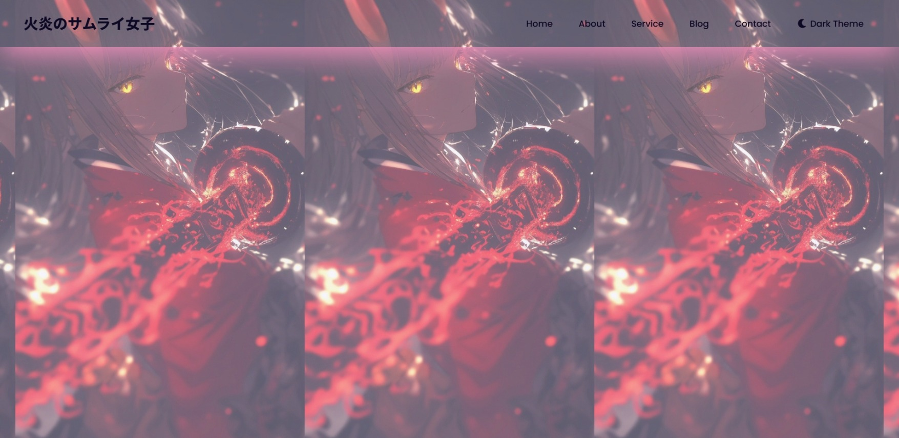
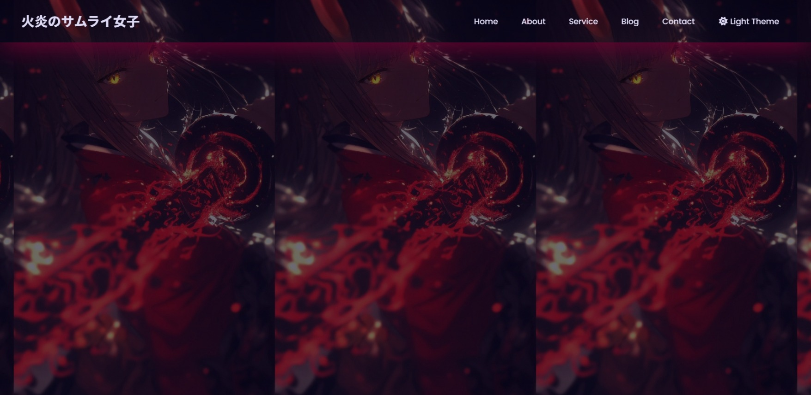
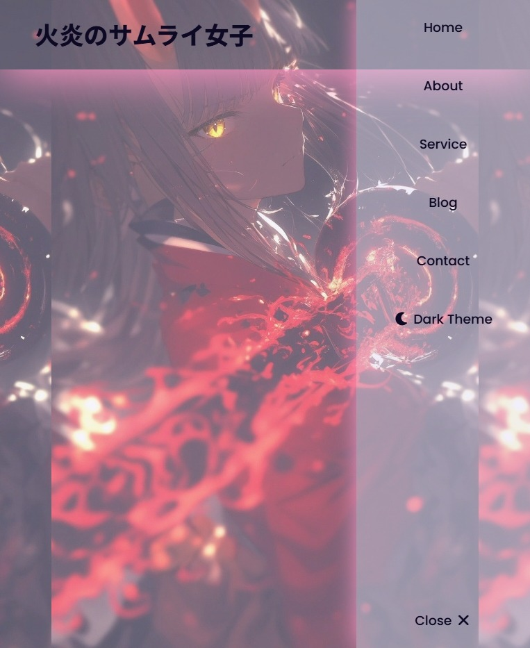
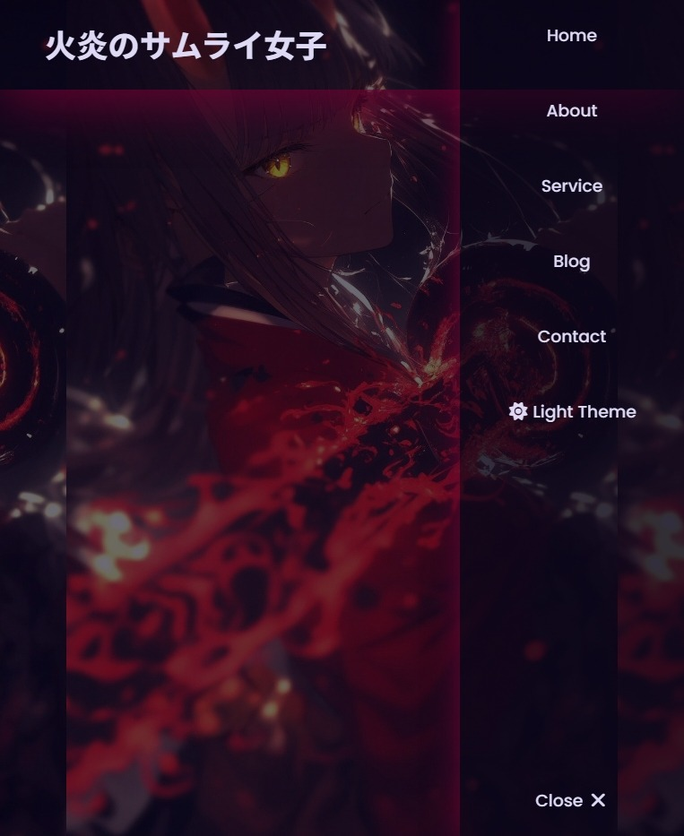

# 🌙 Responsive Navbar Practice Project

A modern responsive **Navbar project** with theme switcher (Light / Dark mode), hamburger menu animation, and smooth mobile transition effect.
Built with **HTML, CSS, and JavaScript** — lightweight yet visually polished.

## 🌐 Live Demo

🔗 **Visit the website:**
👉 [https://nsnet21.github.io/02-responisve-navbar/](https://nsnet21.github.io/02-responisve-navbar/)

## 🖼️ Preview

### ☀️ Light Theme



### 🌙 Dark Theme



## 📱 Mobile Preview Version

### ☀️ Light Theme on Mobile



### 🌙 Dark Theme on Mobile



---

## 🚀 Features

### 🎨 Theme Switcher

- Toggle between **Light / Dark** modes.
- Saves user preference using `localStorage`.
- Changes icon automatically between:
  - ☀️ `fa-sun`
  - 🌙 `fa-moon`

### 🧭 Responsive Navbar

- Fully responsive navigation bar.
- Smooth transition on mobile devices.
- Hamburger toggle animation.
- Click outside to close the menu (for better UX).

### ✨ Modern UI Design

- Uses **CSS Variables** for easy theming.
- Includes **Glassmorphism effect** via `backdrop-filter`.
- Minimalist color scheme with accent glow.

---

## 🧠 Tech Stack

| Stack                     | Description                                           |
| :------------------------ | :---------------------------------------------------- |
| **HTML5**                 | Semantic structure                                    |
| **CSS3**                  | Custom properties, transitions, and responsive design |
| **JavaScript (Vanilla)**  | Handles theme switching and nav toggling              |
| **Font Awesome 7**        | Icon support                                          |
| **Google Fonts: Poppins** | Modern typography                                     |

---

## 🛠️ How to Use

1.  Clone this repository:

    ```bash
    git clone https://github.com/NSNet21/02-responisve-navbar.git
    ```

2.  Open the project folder:

    ```bash
    cd 02-responsive-navbar
    ```

3.  Open `index.html` directly in your browser, or use **Live Server** in VS Code.

## 🧩 Folder Structure

```plaintext
02Responsive-Navbar/
├── assets-preview/
│   ├── light-theme-preview.jpeg
│   ├── dark-theme-preview.jpeg
│   ├── mobile-preview-light-theme.jpeg
│   └── mobile-preview-darkt-heme.jpeg
├── images/
│   └── 火の空気感のサムライガール.jpg
├── index.html
├── script.js
├── style.css
└── README.md
```
